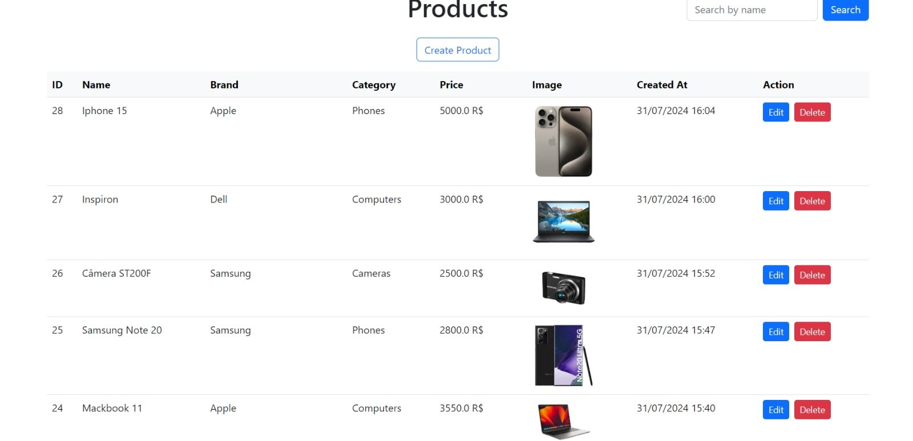

# Sistema de Gestão de Inventário de Produtos

<p>Este projeto é um sistema básico de gestão de inventário de produtos construído usando Java Spring Boot, Spring Web, Thymeleaf, Bootstrap e MySQL.
O sistema permite que os usuários realizem operações CRUD (Criar, Ler, Atualizar, Excluir) em produtos no inventário. </p>

## Funcionalidades
- Listar todos os produtos com detalhes, incluindo ID, Nome, Marca, Categoria, Preço, Imagem e Data de Criação.
- Criar um novo produto com upload opcional de imagem.
- Editar os detalhes de produtos existentes.
- Excluir produtos do inventário.
- Buscar produtos pelo nome.

## Tecnologias Utilizadas
- Backend: Java, Spring Boot, Spring Web, Spring Data JPA
- Frontend: Thymeleaf, Bootstrap
- Banco de Dados: MySQL

## Preview:


## Instruções de Configuração

### Pré-requisitos
- Java 11 ou superior
- Maven
- MySQL

### Configurar o banco de dados:
Atualize a configuração do banco de dados em src/main/resources/application.properties:
```
spring.datasource.url=jdbc:mysql://localhost:3306/product_inventory
spring.datasource.username=seu_usuario
spring.datasource.password=sua_senha
spring.jpa.hibernate.ddl-auto=update
```

### Construir e executar a aplicação:
```
mvn clean install
mvn spring-boot:run
```

### Acessar a aplicação:
Abra o seu navegador e vá para http://localhost:8080/products/list.
